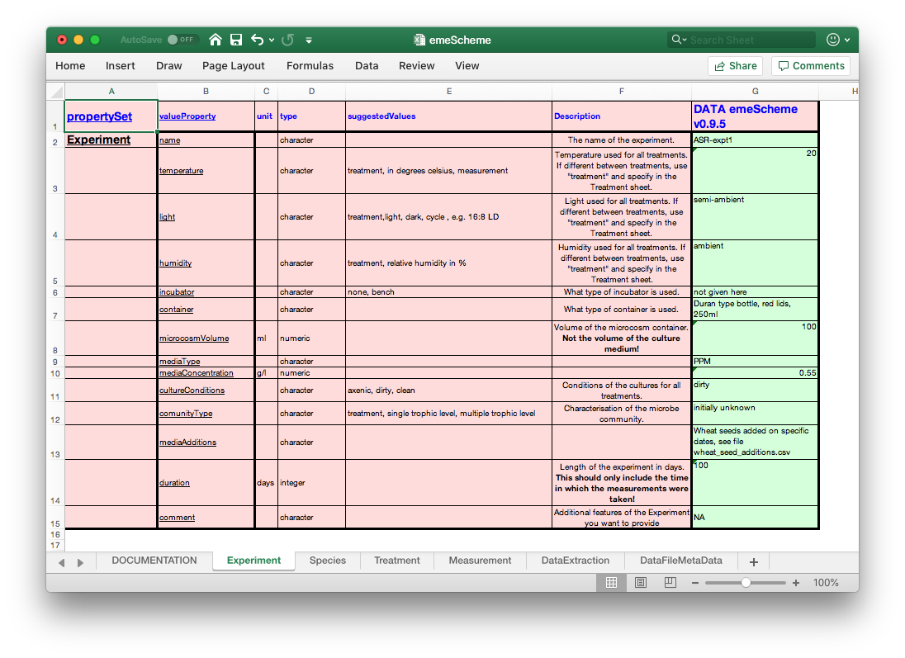
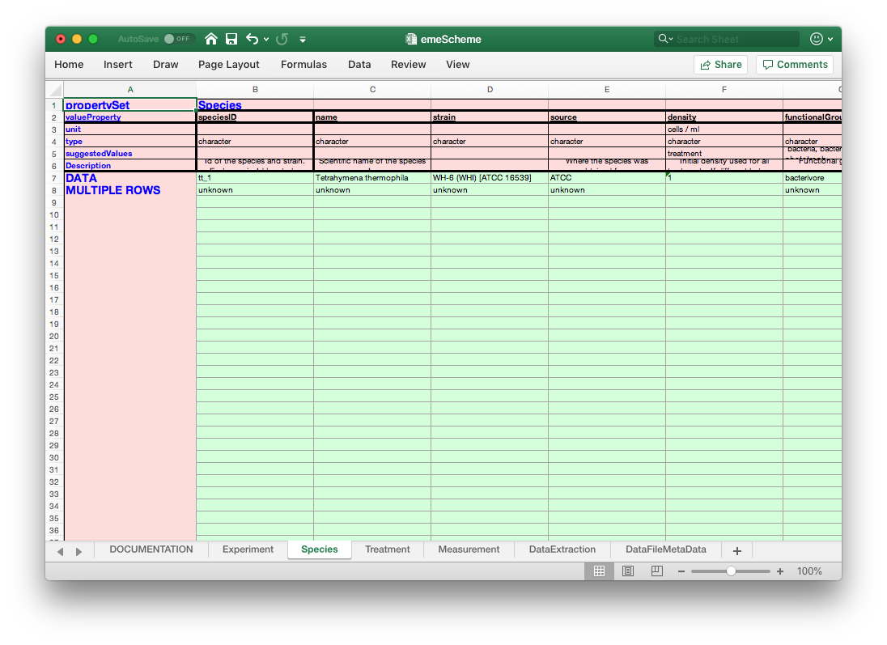
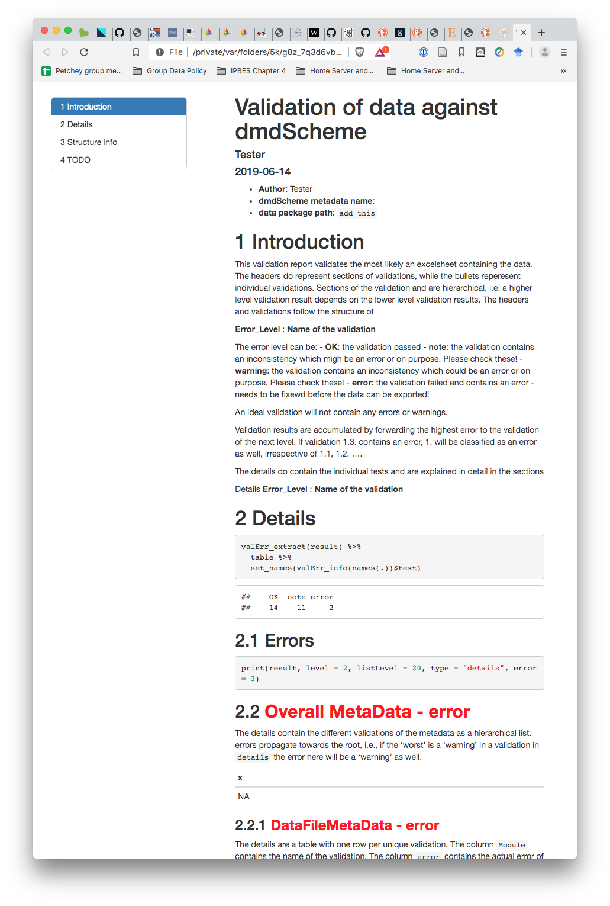
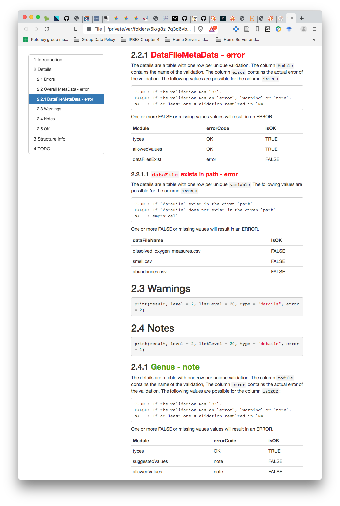
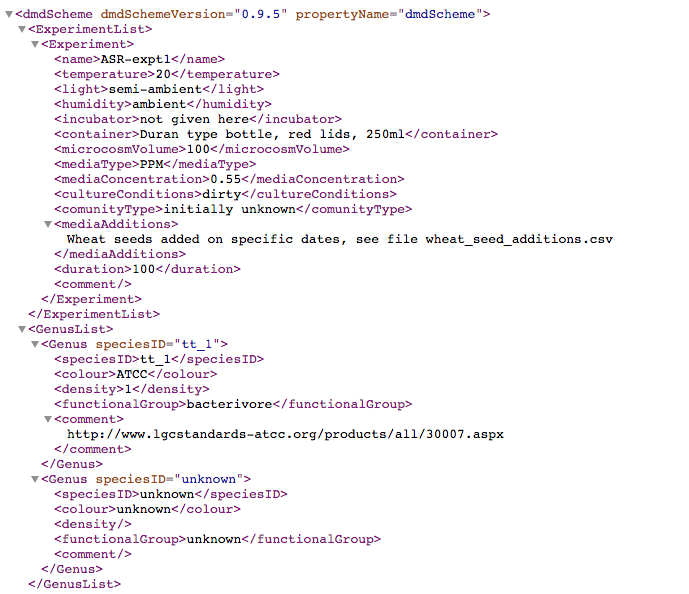

class: center, middle

```{r setup, include=FALSE}
options(htmltools.dir.version = FALSE)
```
```{css, echo=FALSE}
/* custom.css */

.title-slide.remark-slide-content:before{
  position: absolute;
  bottom: 0;
  left: 0;
  content:url(https://zenodo.org/badge/DOI/10.5281/zenodo.2244999.svg);
  height:60px;
}

.left-code {
  color: #777;
  width: 38%;
  height: 92%;
  float: left;
}
.right-plot {
  width: 60%;
  float: right;
  padding-left: 1%;
}
.plot-callout {
  height: 225px;
  width: 450px;
  bottom: 5%;
  right: 5%;
  position: absolute;
  padding: 0px;
  z-index: 100;
}
.plot-callout img {
  width: 100%;
  border: 4px solid #23373B;
}
.middle-text {
  color: #777;
  width: 30%;
  height: 100%;
  float: middle;
}
.left-text {
  color: #777;
  width: 30%;
  height: 100%;
  float: left;
}
.right-text {
  color: #777;
  width: 30%;
  height: 100%;
  float: right;
}

.scroll {
  background: #FFBB33;
  width: 100%;
  height: 80%;
  overflow-x: scroll;
  overflow-y: scroll;
  padding-right: 1px;
  padding-bottom: 1px;
}

.dt {
  font-size: 11px;
}

```


# MetaData

---
layout: true
class: animated, fadeIn
---
class: center, middle


---
class: center, middle

# Data about Data
---
class: center, middle


---
class: center, middle


---
class: center, middle


---
class: center, middle
Change to MetaData in your mind


---
class: center, middle


---
class: center, middle
Change to MetaData in your mind


---
class: center, middle, inverse


---
class: center, middle, inverse


---
class: inverse

# Metadata is complex and divers


---
class: inverse

# Metadata is complex and divers
 ==> Metadata Schemes bring structure

--


--

==> Metadata Schemes are complex

---
class: inverse

# Introducing: Domain Specific Metadata Schemes (dmdScheme)

--

- Specific for requirements of domain

--

- Buy-in from scientists through **participation in development of the dmdScheme**

--

- Poisot et al., 2019: Metadata schemes for scientific domains, subdomains, research types, ...

Poisot, T., Bruneau, A., Gonzalez, A., Gravel, D., Peres-Neto, P., 2019. Ecological Data Should Not Be So Hard to Find and Reuse. Trends in Ecology & Evolution 0. https://doi.org/10.1016/j.tree.2019.04.005

---
class: inverse


---
class: inverse

# Entering Metadata


---
class: inverse

# Data Format

--

- machine readable

- human readable

--

- XML

--


---
class: inverse

# Introducing: R package dmdScheme

--

Entering Metadata in spreadsheet

--



---
class: inverse
# Introducing: R package dmdScheme
Entering Metadata in spreadsheet



---
class: inverse

# Introducing: R package dmdScheme

--

Validate Spreadsheet

--

```{r eval=FALSE}
validate_report("SPREADSHEET.xlsx")
```

--



---
class: inverse

# Introducing: R package dmdScheme
Validate Spreadsheet
```{r eval=FALSE}
validate_report("SPREADSHEET.xlsx")
```


---
class: inverse

# Introducing: R package dmdScheme

--

Export Spreadsheet to xml

--

```{r eval=FALSE}
dmdScheme_to_xml( 
   read_from_excel("SPREADSHEET.xlsx"), 
   file = "metadata.xml" 
)
```

--



---
class: center, middle, inverse 


---
class: center, middle


---
class: inverse

# Competing or Not?

--

- Not!
- dmdSchemes are subsets of other schemes ([Darwin Core](http://rs.tdwg.org/dwc/), [Ecological Metadata Language ](https://knb.ecoinformatics.org/external/emlparser/docs/eml-2.1.1/index.html))

--
# Ontologies
- You don't want to go there right now! Promise!

--
# Simply linking Metadata Properties

---
