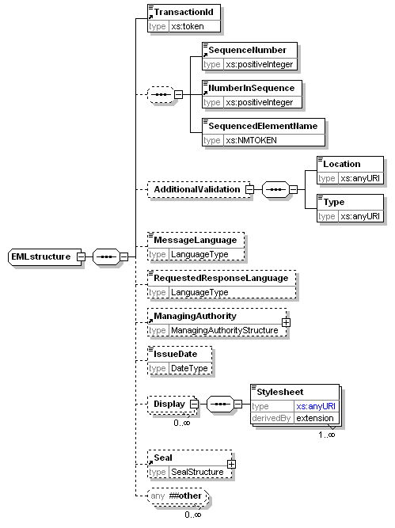
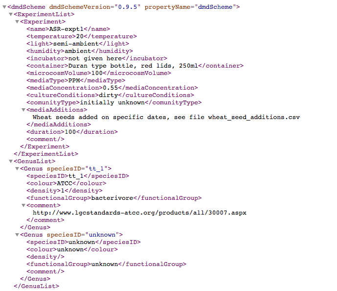
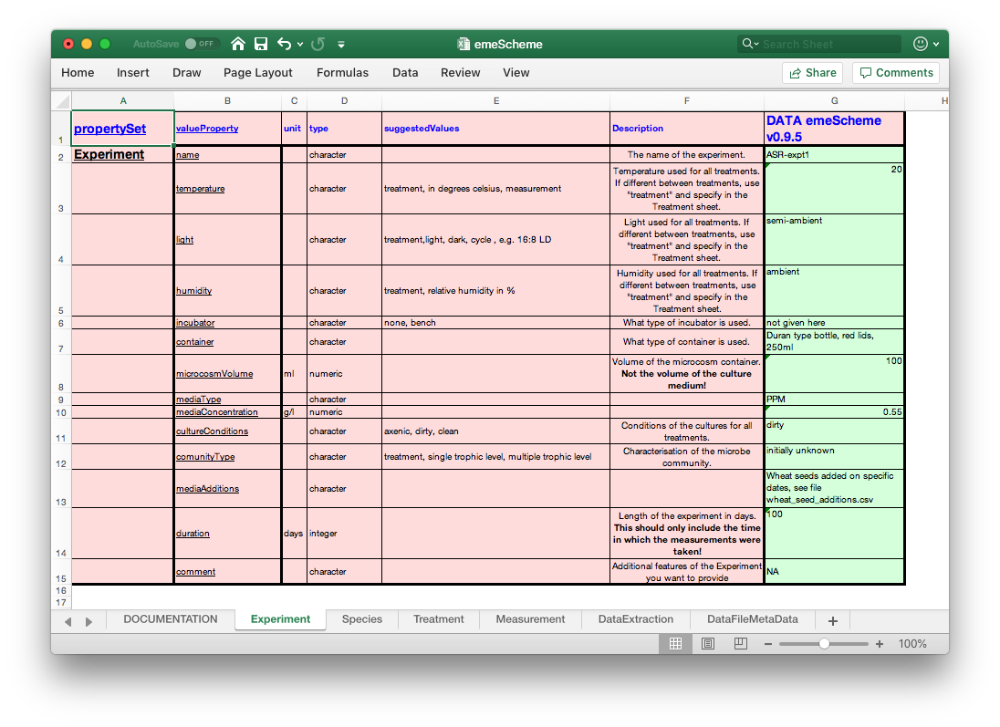
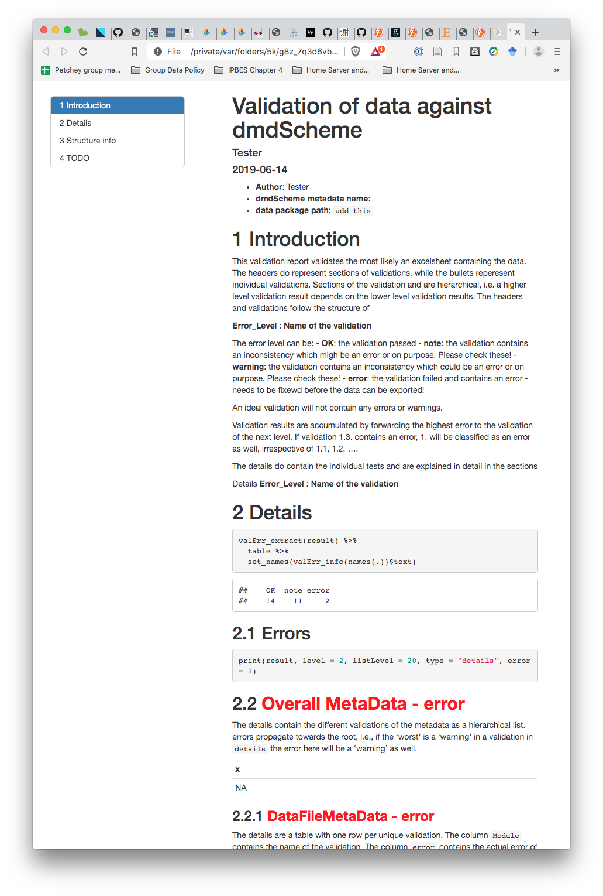
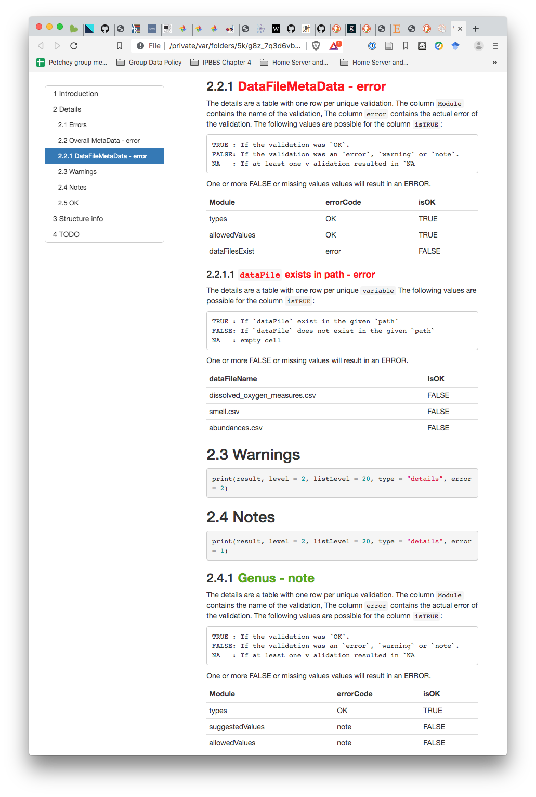

class: center, middle, inverse

```{r setup, include=FALSE}
options(htmltools.dir.version = FALSE)
```
```{css, echo=FALSE}
/* custom.css */

.title-slide.remark-slide-content:before{
  position: absolute;
  bottom: 0;
  left: 0;
  content:url(https://zenodo.org/badge/DOI/10.5281/zenodo.3246326.svg);
  height:60px;
}


.alert {
  color: #FF0000;
  text-align: center;
  font-size: xx-large;
  float: middle;
}

.dt {
  font-size: x-small;
  float: left;
  bottom: 0;
}]

```


# MetaData

---
layout: true
class: inverse, animated, fadeIn
---
class: center, middle, inverse


.dt[ [icanbareleydraw](http://www.icanbarelydraw.com/comic/wp-content/uploads/2013/06/metadata-1200dpi.png) ]
---
class: center, middle

# Data about Data
---
class: center, middle


.dt[ [randylane](http://randylane.com/wp-content/uploads/2014/09/5141328136_16d8f73ee7_b.jpg) ]

---
class: center, middle


.dt[ [istockphoto](https://media.istockphoto.com/photos/woman-scientist-screaming-picture-id616093188?k=6&m=616093188&s=612x612&w=0&h=1nrZy_8hdnd0BxG1_q60kBbFYmCrrPkyDe_LvKurKjU=) ]

---
class: center, middle


.dt[ [https://i.ytimg.com/vi/YsUyzkjOY_c/maxresdefault.jpg](https://i.ytimg.com/vi/YsUyzkjOY_c/maxresdefault.jpg) ]

---
class: center, middle
Change to MetaData in your mind


.dt[ [nomorewallstreet](http://nomorewallstreet.com/wp-content/uploads/2014/10/taxes.jpg)]

---
class: center, middle


.dt[ [gobankingrates](https://cdn.gobankingrates.com/wp-content/uploads/2017/09/0-main-filing-taxes-romanr-shutterstock_583001296-848x477.jpg) ]

---
class: center, middle

Change to MetaData in your mind


.dt[ [nerdwallet](http://assets.nerdwallet.com/blog/wp-content/uploads/2015/10/8-student-faqs-about-taxes.jpg)  ]

---
class: center, middle


.dt[ [ogsl](https://ogsl.ca/sites/default/files/FAIR_EN.png)  ]

---
class: center, middle


.dt[ [edgefoscholars](https://edgeforscholars.org/wp-content/uploads/2017/04/happy-scientists.jpg)  ]
---

# Metadata is complex and divers


.dt[ [randylane](http://randylane.com/wp-content/uploads/2014/09/5141328136_16d8f73ee7_b.jpg)]

---

# Metadata is complex and divers
 ==> Metadata Schemes bring structure

--



--

==> Metadata Schemes are complex

.dt[ [oasis-open](http://docs.oasis-open.org/election/eml/v5.0/cs01/EML-Schema-Descriptions-v5.0_files/image028.gif)]

---
class: inverse

# Introducing: Domain Specific Metadata Schemes (dmdScheme)

--

- Specific for requirements of domain

--

- Buy-in from scientists through **participation in development of the dmdScheme**

--

- Poisot et al., 2019: Metadata schemes for scientific domains, subdomains, research types, ...

Poisot, T., Bruneau, A., Gonzalez, A., Gravel, D., Peres-Neto, P., 2019. Ecological Data Should Not Be So Hard to Find and Reuse. Trends in Ecology & Evolution 0. https://doi.org/10.1016/j.tree.2019.04.005

---
class: inverse


.dt[ [odgeforscholars](https://edgeforscholars.org/wp-content/uploads/2017/04/happy-scientists.jpg)
---
class: inverse

# Entering Metadata


.dt[ [gobankingrates](https://cdn.gobankingrates.com/wp-content/uploads/2017/09/0-main-filing-taxes-romanr-shutterstock_583001296-848x477.jpg)]

---
class: inverse

# Data Format

--

- machine readable

- human readable

--

- XML

--



---

# Introducing: R package dmdScheme

--

Entering Metadata in spreadsheet

--



---

# Introducing: R package dmdScheme
Entering Metadata in spreadsheet


---

# Introducing: R package dmdScheme

--

Validate Spreadsheet

--

```{r eval=FALSE}
validate_report("SPREADSHEET.xlsx")
```

--



---

# Introducing: R package dmdScheme
Validate Spreadsheet
```{r eval=FALSE}
validate_report("SPREADSHEET.xlsx")
```


---

# Introducing: R package dmdScheme

--

Export Spreadsheet to xml

--

```{r eval=FALSE}
dmdScheme_to_xml( 
   read_from_excel("SPREADSHEET.xlsx"), 
   file = "metadata.xml" 
)
```

--


---
class: center, middle 


---
class: center, middle


---
class: inverse

# Competing or Not?

--

- Not!
- dmdSchemes are subsets of other schemes ([Darwin Core](http://rs.tdwg.org/dwc/), [Ecological Metadata Language ](https://knb.ecoinformatics.org/external/emlparser/docs/eml-2.1.1/index.html))

--

# Ontologies

--

.alert[ You don't want to go there! ]

--

.alert[ Not now! ]

--

.alert[ Trust me! ]

--
# Simply linking Metadata Properties

---
